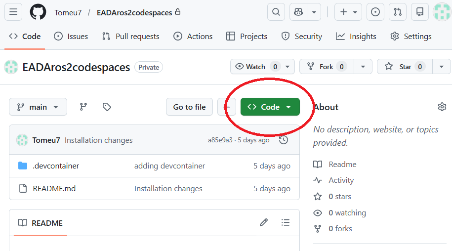
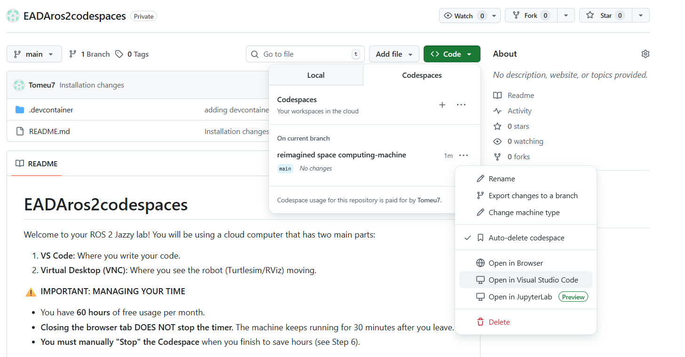
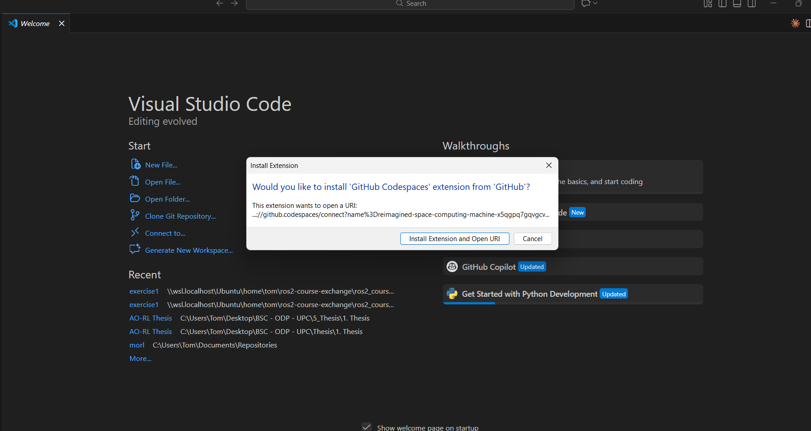
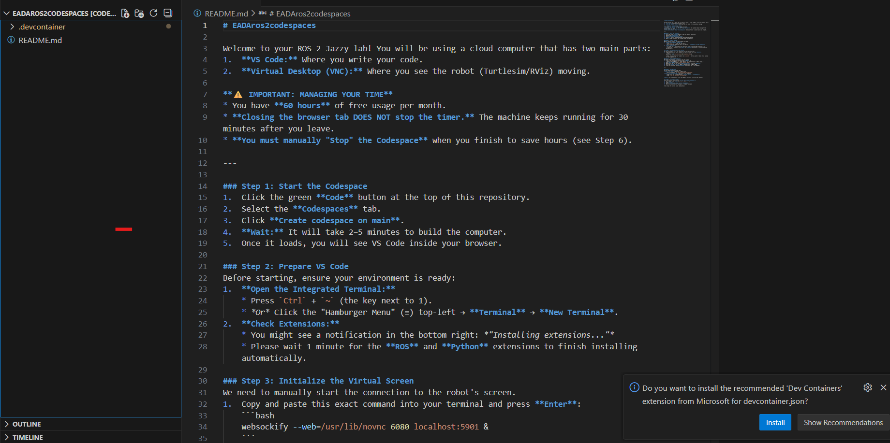
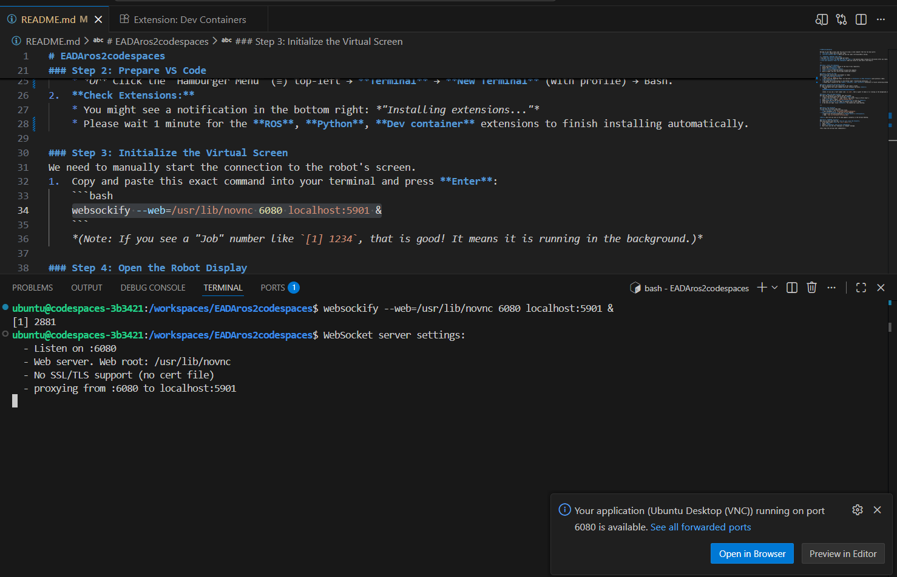
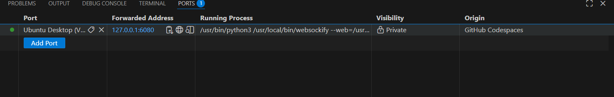
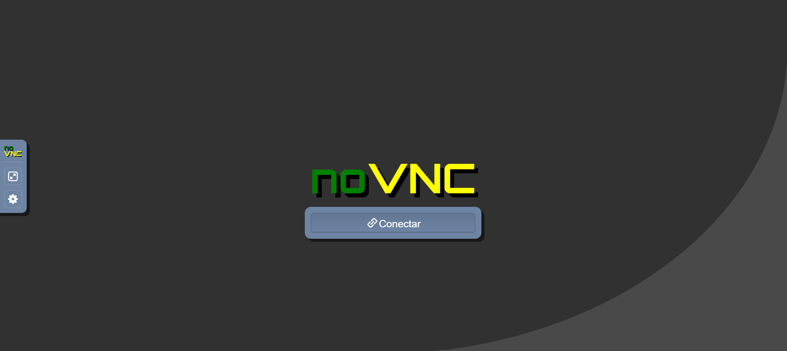
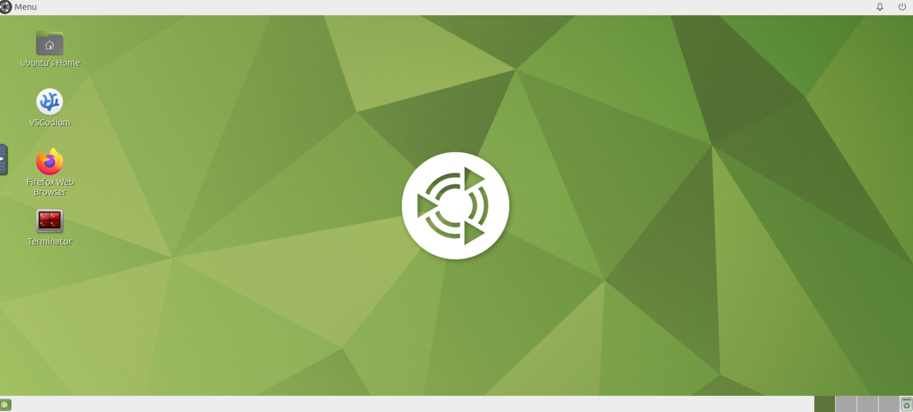
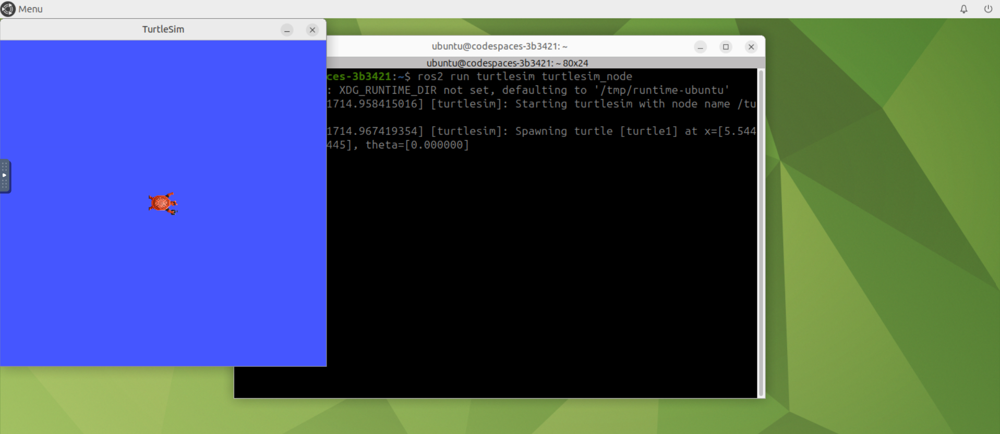

# EADAros2codespaces

Welcome to your ROS 2 Jazzy lab! You will be using a cloud computer that has two main parts:
1.  **VS Code:** Where you write your code.
2.  **Virtual Desktop (VNC):** Where you see the robot (Turtlesim/RViz) moving.

**⚠️ IMPORTANT: MANAGING YOUR TIME**
* You have **60 hours** of free usage per month.
* **Closing the browser tab DOES NOT stop the timer.** The machine keeps running for 30 minutes after you leave.
* **You must manually "Stop" the Codespace** when you finish to save hours (see Step 6).

---

### Step 1: Start the Codespace
1.  Click the green **Code** button at the top of this repository.
2.  Select the **Codespaces** tab.
3.  Click **Create codespace on main**.
4.  **Wait:** It will take 2–5 minutes to build the computer.
5.  Once it loads, you will see VS Code inside your browser.



### Step 2: Prepare VS Code
Before starting, ensure your environment is ready:
1.  **Open the Integrated Terminal:**
    * Press `Ctrl` + `Shift` + `p`.
    * *Or* Click the "Hamburger Menu" (≡) top-left → **Terminal** → **New Terminal** (with profile) → Bash.
2.  **Check Extensions:**
    * You might see a notification in the bottom right: *"Installing extensions..."*
    * Please wait 1 minute for the **ROS**, **Python**, **Dev container** extensions to finish installing automatically.



### Step 3: Initialize the Virtual Screen
We need to manually start the connection to the robot's screen.
1.  Copy and paste this exact command into your terminal and press **Enter**:
    ```bash
    websockify --web=/usr/lib/novnc 6080 localhost:5901 &
    ```
    *(Note: If you see a "Job" number like `[1] 1234`, that is good! It means it is running in the background.)*


### Step 4: Open the Robot Display
Now that the connection is running, open the screen:
**Note:** You might not need steps 1-4 on all machines; skip this section if the display already opens for you.
1.  Look at the bottom panel and click the **PORTS** tab.
    * *Don't see it? Press `F1`, type "Ports", and select "Focus on Ports View".*
2.  Find **Port 6080** (Label: `Ubuntu Desktop (VNC)`).
3.  Right-click the row and verify **Port Visibility** is set to **Public**.
4.  Click the **Globe Icon 🌐** (Open in Browser) next to Port 6080.
5.  A new tab will open. Click **Connect**. You should see a gray desktop.



---

### Step 5: Your Workflow
You now have two browser tabs open.
* **Tab A (VS Code):** Use this to edit files.
    * Your workspace is in `/workspaces/EADAros2codespaces`.
* **Tab B (Virtual Desktop):** Use this to run commands.
    * Right-click the gray background → **System Tools** → **Terminator**.
    * Type: `ros2 run turtlesim turtlesim_node`.

**Note:** Any file you save in VS Code appears instantly in the Virtual Desktop.



### Step 6: STOPPING (Crucial!)
When you are done with the lab, **do not just close the browser**.
1.  In VS Code, press **F1** (or `Ctrl`+`Shift`+`P`).
2.  Type **Stop**.
3.  Select **Codespaces: Stop Current Codespace**.
4.  Wait until you see the "Codespace is stopped" message.

*This stops the billing timer immediately.*

---

### Saving Your Code (Optional)
If you want a copy of your work outside the Codespace, you need to download it or push it to GitHub (for example, by forking this repo and pushing your changes).
